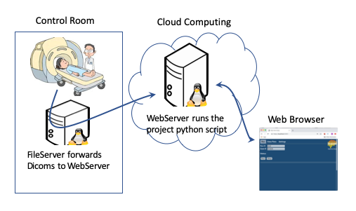

# Realtime fMRI Cloud Framework
This is a generic framework for building real-time fMRI processing pipelines in the cloud.

## How it works
There are three general components:
- File Server
  - Watches for new dicom images written by the MRI scanner.
  - Sends the dicom images to the webServer in the cloud.
  - Listens for requests from the webServer to either read or write files (within restricted directories) on the scanner computer.
- Web Server
  - Runs in the cloud.
  - Provides a user interface to start/stop and configure a run.
  - Is the communication link between the fileServer and the project specific code that runs in the cloud.
- Project Script
  - Code specific to the fMRI study being done.
  - Waits for dicom files to arrive, creates a data model, returns classification results to the fileServer for feedback purposes.

A webServer is started on the cloud computer. The webServer has a user interface that allows configuring and starting a run. The webserver is configured so that the start-run button starts the project specific script. The webserver also serves as the intermediary for communication between the the fileserver (running in the control room) and the project specific script (running in the cloud).

A fileServer is started on the scanner computer that can watch for files within specified directories. The fileServer connects to the webServer. The fileServer requires a username and password to connect to and login to the webServer.

## Making your project web enabled
Make a new directory under rt-cloud/projects for your project.
Use the sample project in rt-cloud/projects/sample as a template for making your python script web enabled. The sample.py script corresponds to the script for your experiment, and the webMain.py script can be copied to your project directory and edit one line 'scriptToRun' to point to your script.

### Project Code
You'll need to copy several blocks of code to your project to get it web enabled. These are:

1) Accept at least the following command line parameters in your project python file:

    argParser = argparse.ArgumentParser()
    argParser.add_argument('--config', '-c', default=defaultConfig, type=str,
                           help='experiment config file (.json or .toml)')
    argParser.add_argument('--runs', '-r', default='', type=str,
                           help='Comma separated list of run numbers')
    argParser.add_argument('--scans', '-s', default='', type=str,
                           help='Comma separated list of scan number')
    # This parameter is used by webserver
    argParser.add_argument('--webpipe', '-w', default=None, type=str,
                           help='Named pipe to communicate with webServer')
    argParser.add_argument('--filesremote', '-x', default=False, action='store_true',
                           help='dicom files retrieved from remote server')
    args = argParser.parse_args()

2) Set up communication with the web server

    webComm = None
    if args.webpipe:
        webComm = wcutils.openWebServerConnection(args.webpipe)
        wcutils.watchForExit()

3) Open a FileInterface object for reading and writing files

    fileInterface = FileInterface(filesremote=args.filesremote, webpipes=webComm)

Then within your python script, use the FileInterface object to request remote files. For example to retrieve dicom images as they are created, init a watch on the appropriate directory and then watch for them.

    fileInterface.initWatch('/tmp/dicoms', 'samp*.dcm', minFileSize)
    rawData = fileInterface.watchFile('/tmp/samp3.dcm')

Or use the readRetryDicom helper function which returns a Dicom image structure

    fileInterface.initWatch('/tmp/dicoms', 'samp*.dcm', minFileSize)
    dicomData = readRetryDicomFromFileInterface(fileInterface, samp3.dcm, timeout=10)

Write classification results back to the console computer using putTextFile

    fileInterface.putTextFile(fullpath_filename_to_save, text_to_save)

Read files from the console computer using getFile

    data = fileInterface.getFile(fullpath_filename)

Or read the newest file matching a file pattern such as 'samp*.dcm'

    data = fileInterface.getNewestFile(fullpath_filepattern)

### Project Configuration
Use a TOML file for configuration settings. Use the loadConfigFile funtion to load your configurations into a structured object

    import rtCommon.utils as utils
    cfg = utils.loadConfigFile(args.config)

Access configurations within the config structure

    print(cfg.subjectName, cfg.subjectDay)

The following fields must be present in the config toml file for the web version to work:
  - Runs ([] array)
  - ScanNums ([] array)
  - subjectName
  - subjectDay

## Installation
The following instructions assume a Linux CentOS 7 installation.

Pull the source code

    git clone https://github.com/brainiak/rt-cloud.git
    cd rt-cloud/

Make a private key and an ssl certificate or copy an existing one into the certs directory

    mkdir certs
    openssl genrsa –out certs/rtcloud_private.key 2048
    bash scripts/make-sslcert.sh -ip <local_ip_addr>

Install mini-conda and create the conda environment

    wget https://repo.continuum.io/miniconda/Miniconda3-latest-Linux-x86_64.sh
    bash Miniconda3-latest-Linux-x86_64.sh -b
    conda env create -f environment.yml
    conda activate rtcloud

Install node and node module dependencies

    sudo yum install epel-release
    sudo yum install nodejs
    cd web; npm install

 Create users - run 'add-user.sh' script and add new username and password

    bash scripts/add-user.sh

 Run the web server

    bash scripts/run-webserver.sh -p sample -c projects/sample/conf/sample.toml ip <local_ip_addr>

 From the console computer where dicoms are written, clone the rt-cloud code, copy the ssl certificate created above to this rt-cloud/certs dir and run the file server

    bash scripts/run-fileserver.sh -s <web_ip>:<web_port> -d <allowed_dir1,allowed_dir2> -u <username> -p <password>

## Running the Webserver
The webServer can be run on a 'local' computer, meaning on the same computer in the control room where the dicom images are written. Or it can be run on a 'remote' computer, meaning some computer possibly outside of the control room which doesn't have direct access to the dicom images.
### Running Locally
**1) Start the webServer**

    bash scripts/run-webserver.sh -p <your_project_name> -c <config_file> -ip <local_ip_addr> --localfiles
Example:

    bash scripts/run-webserver.sh -p sample -c projects/sample/conf/sample.toml -ip 125.130.21.34 --localfiles

The -p option is used to locate your project in the rt-cloud/projects directory, the name specified should match your project directory name.

The -ip option is to update the ssl certificate to include the webServer's ip address. Specify the ip address where the webServer is being started.

### Running Remotely
**1) Start the webServer** same command as above but without --localfiles option

    bash scripts/run-webserver.sh -p <your_project_name> -c <config_file> -ip <local_ip_addr>

Example:

    bash scripts/run-webserver.sh -p sample -c projects/sample/conf/sample.toml -ip 125.130.21.34

**2) Start the fileWatcher.** The fileWatcher is started on the control room computer where the dicom images are written. It can forward those images to the webServer when requested by your project code.

    bash scripts/run-fileserver.sh -s <webserver_addr:port> -d <allowed_dirs> -f <allowed_file_extensions> -u <username> -p <password>
Where username and password are the credentials to login to the webServer

Example:

    bash scripts/run-fileserver.sh -s 125.130.21.34:8888 -d /tmp,/dicom -f .dcm,.txt

## Connecting with the Browser
Open a browser and navigate to 
**https://<webserver_addr>:8888**

You will need to add the ssl certificate to your list of trusted certificates. Copy the ssl certificate created above to your browser computer.

On Mac:
1. Open application 'Keychain Access'.
2. Click on 'Certificates' in bottom left pane
3. Select File->Import Items... and select the ssl certificate downloaded to your computer
4. In 'Certificates' pane, double-click the 'rtcloud.princeton.edu' certificate
5. Select the 'Trust' drop-down item.
6. In 'When using the certificate' selector choose 'Always Trust'
