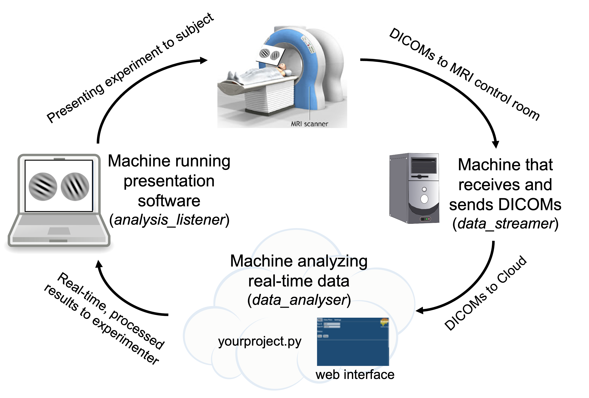

# Realtime fMRI Cloud Framework

- [Github Repo](https://github.com/brainiak/rt-cloud)
- [Read-The-Docs](https://rt-cloud.readthedocs.io)

The Realtime fMRI Cloud Framework is an open-source software package that makes it easier to build and deploy real-time fMRI experiments. RT-Cloud streams scanner data (DICOM images) over to the cloud (or any machine) for real-time analysis, which then can be forwarded to the machine presenting stimuli to the participant, allowing for real-time control over experiment presentation (e.g., depicting trial-by-trial neurofeedback to the subject via PsychoPy, jsPsych, MATLAB PsychToolbox, etc.). RT-Cloud supports neuroimaging standards such as BIDS and OpenNeuro.org.

RT-Cloud supports any sort of machine configuration. You could run RT-Cloud entirely on a local computer or you can have separate machines handling each of the below three components.

For more information on RT-Cloud, see our paper in [NeuroImage 2022](https://www.sciencedirect.com/science/article/pii/S1053811922004141). If you publish work that utilized RT-Cloud, please include a citation to this paper.

**Overview of RT-Cloud Components**
 
- **data_streamer** (runs on machine that recieves/sends DICOMs)
  - Watches for new DICOM brain images and sends them to whatever machine is analysing the data
  - Can simulate the transfer of DICOMs from the MRI scanner using a precollected folder of DICOMs or via an OpenNeuro dataset (OpenNeuroService)
- **data_analyser** (runs on machine that analyses data in real-time)
  - Runs experimenter’s script to process DICOMs
  - Provides a web-based user interface for experimenter control
- **analysis_listener** (runs on machine that runs presentation software)
  - Listens for results from data_analyser to inform experiment presentation (e.g., PsychoPy, jsPsych, MATLAB PsychToolbox) 

As an example for how you could setup the RT-Cloud components across machines, you could have the MRI workstation running data_streamer, a cloud-based virtual machine running data_analyser, and the experimenter’s laptop presenting stimuli based on the results from analysis_listener.

Development of RT-Cloud was initially funded by Intel Labs; the framework is under active development with funding from NIMH to further extend its capabilities.

# Quickstart Demo: sample project via Docker

Assuming that Docker is installed (if not, see instructions below) you can follow these instructions to automatically run a sample project that demonstrates some of RT-Cloud's functionality. The three aforementioned components will be run on a single machine without SSL encryption. Ten DICOM files will be analyzed in real-time and the average brain activation for each TR will be plotted in the RT-Cloud web browser's "Data Plots" tab.

**Docker**

    docker run -it --rm -p 8888:8888 brainiak/rtcloud:latest scripts/data_analyser.sh -p sample --test 

Wait for the terminal to output "Listening on: http://localhost:8888" and then open your web browser and go to the url "localhost:8888" (if using a cloud machine, replace "localhost" to the cloud server's ip address). The login username/password for the web browser are both "test". Click the "Run" button to run through the simulated real-time scanning example. 

# RTCloud Installation & Usage 

## 1. Install Docker, Singularity, or Miniconda

You can use either Docker, Singularity, or a local Conda environment to run RTCloud. 

### Docker Installation

Windows: https://docs.docker.com/desktop/windows/install/

- Note that Windows has a quirk when it comes to volume mounting with Docker. Docker commands along the lines of "-v $PROJ_DIR" require a backslash "/" before the directory (e.g., "-v /$PROJ_DIR"). Volume mounting also requires full paths: e.g., "-v ~/certs" would need to be replaced with the full path "-v /c/Users/paul/certs". 
- If using Git Bash, you will need to add "winpty" before all Docker commands.

Mac: https://docs.docker.com/desktop/mac/install/

- M1 Macs are not supported! All RTCloud functionality will work but scripts will run very slowly. You should follow the local installation instructions instead. 

Linux: https://docs.docker.com/engine/install/

<!-- Example of terminal commands for Linux (CentOS) installation:

    sudo yum install -y yum-utils device-mapper-persistent-data lvm2
    sudo yum-config-manager -y --add-repo https://download.docker.com/linux/centos/docker-ce.repo
    sudo yum install -y docker-ce docker-ce-cli containerd.io -->

**Pull RTCloud Docker image**

Either pull rtcloud (9Gb, recommended), rtcloudxl (30Gb), or rtcloudlite (3.6Gb)

<code>docker pull brainiak/rtcloud:latest</code>

- "rtcloud": RTCloud, FSL analysis functions (no fsleyes), most of ANTs, c3d_affine_tool, brainiak, VNC Viewer
- "rtcloudxl": RTCloud, FSL, fsleyes, ANTs, Convert3D, brainiak, VNC Viewer
- "rtcloudlite": RTCloud, brainiak, VNC Viewer

Docker images operate in Linux CentOS and use a miniconda environment called "rtcloud" that contains many preinstalled packages (see environment.yml, environment-synthetic-data.yml, websockify.yml, docker/Dockerfile.rttools).

### Singularity Installation

Singularity can be used if you lack root permissions to install RT-Cloud via Docker.

Linux install: https://sylabs.io/guides/3.9/admin-guide/installation.html

Example of terminal commands for Linux (CentOS 7) installation:

    sudo yum update -y && \
    sudo yum install -y epel-release && \
    sudo yum update -y && \
    sudo yum install -y singularity-runtime singularity

Clone this GitHub repository, cd into it, and build the Singularity image corresponding to the Docker container you wish to run: rtcloud (9Gb, recommended), rtcloudxl (30Gb), or rtcloudlite (3.6Gb).

1. <code>git clone https://github.com/brainiak/rt-cloud.git</code>
2. <code>cd rt-cloud/docker/</code>
3. <code>sudo singularity build rtcloud.sif rtcloud.def</code>

If you lack root permissions, you will need to build the .sif file on a machine that has root permissions and then transfer the .sif file.

**Singularity usage instructions.** Enter your Singularity image running RT-Cloud. Then execute a few commands to setup your environment:
1. <code>cd rt-cloud/</code>
2. <code>singularity exec docker/rtcloud.sif bash</code>
3. <code>source /opt/.bashrc</code>
4. Install node module dependencies 
    - <code>cd web; npm install; cd ..</code>

You will need to perform steps 1-3 every time you enter the Singularity image (step 4 installation will persist so you do not need to repeat it.)

Now you can follow the same steps as the local installation to run RT-Cloud via Singularity! Note that ``source /opt/.bashrc`` activates the pre-made "rtcloud" conda environment.

### Local Installation
(Note: Windows not supported.)

1. Install miniconda
    - If not installed, follow these steps to install miniconda: https://docs.conda.io/en/latest/miniconda.html
2. Clone rt-cloud code from github and cd into it
    - <code>git clone https://github.com/brainiak/rt-cloud.git</code>
    - <code>cd rt-cloud/</code>
3. Prepare rtcloud conda environment 
    - <code>conda create --name rtcloud</code> 
        - Note: you must use the name "rtcloud" for your conda environment!
    - <code>conda activate rtcloud</code>
4. Install necessary packages
    - <code>conda install -y -c defaults -c conda-forge awscli bcrypt boto3 dcm2niix flake8 indexed_gzip jupyter mypy nibabel nilearn nodejs pip pydicom python=3.8 requests rpyc scipy toml tornado websocket-client</code>
    - <code>pip install inotify pybids watchdog wsaccel</code>
5. Install node module dependencies 
    - <code>cd web; npm install; cd ..</code>
6. Install [FSL](https://fsl.fmrib.ox.ac.uk/fsl/fslwiki/FslInstallation), [ANTs](http://stnava.github.io/ANTs/), or any other software that you plan to use for real-time analysis

## 2. Making RTCloud secure with SSL encryption

If you do not care about SSL encryption and simply want to test out RTCloud without security, you can skip this step (you will need to add the "--test" flag to all commands in step 4). The RT-Cloud web interface will use "https" with SSL encryption and "http" without SSL encryption.

### 2a. Create SSL certificate and username/password

The following instructions will create a "certs" folder on your machine. Do this step only once on one machine. To allow for encrypted communication across RTCloud components, the path to this certs folder needs to be provided every time you run RTCloud components. Replace "username" in the below code with the username you want to use to login to the RTCloud web interface. 

**Docker**

The below code will create a certs folder located in your home directory.

    docker run -it --name ssl brainiak/rtcloud:latest bash

You will now be within the RTCloud docker image in terminal. Replace "username" below with the username you want to use to login to the RTCloud web browser.

    IP=`curl https://ifconfig.co/`
    conda deactivate; conda activate rtcloud
    openssl genrsa -out certs/rtcloud_private.key 2048
    bash scripts/make-sslcert.sh -ip $IP
    bash scripts/add-user.sh -u username

You will be prompted to enter a password.

    exit
    docker cp ssl:/rt-cloud/certs ~/certs
    docker rm -f ssl

<!-- **Singularity**

    IP=`curl https://ifconfig.co/`
    docker run -it --name ssl docker://brainiak/rtcloud:latest scripts/make-sslcert.sh -ip $IP
    docker cp ssl:/rt-cloud/certs ~/certs
    docker rm -f ssl -->

**Local** 

The below code will create a certs folder in your current working directory. Make sure you keep note of the path where this certs folder lives for later.

    IP=`curl https://ifconfig.co/`
    mkdir certs; openssl genrsa -out certs/rtcloud_private.key 2048
    bash scripts/make-sslcert.sh -ip $IP
    bash scripts/add-user.sh -u username
    # You will be prompted to enter a password.

### 2b. Copy your certs folder to all other machines

**If you are using RTCloud across multiple machines, you should only create a certs folder once**. Then, you should copy this certs folder to the other machines. All RTCloud machines must contain identical certs/rtcloud_private.key and certs/passwd files.

### 2c. Install SSL certificate

**Perform this step on the machine that will be used to open the RTCloud web interface via a web browser (e.g., Chrome, Safari).**

*On Mac:*

1. Open application 'Keychain Access'.
2. On left sidebar, click 'Login' under Default Keychain.
3. Drag and drop your ssl certificate ("~/certs/rtcloud.crt" or "rt-cloud/certs/rtcloud.crt") into the window
4. Your certificate should now show up in the 'Keychain Access' certifications list
5. Double-click the certification > Trust > 'When using this certificate' choose 'Always Trust'

*On Linux:*

When you eventually go to use the web interface, a security warning about untrusted certificate will show up. When this happens, click "Add Exception" > "Confirm Security Exception".

*On Windows:* 

Follow the instructions outlined on this webpage: https://learn.microsoft.com/en-us/skype-sdk/sdn/articles/installing-the-trusted-root-certificate

## 3. Prepare your experiment's script
You will need to prepare a folder containing whatever analysis steps you want to be performed in real-time. We supply a pre-made projects folder that contains several examples for you to try out (https://github.com/brainiak/rtcloud-projects). **We highly recommend that you first try running the template project** ("rtcloud-projects/template"), which is an example analysis that runs through a complete RT-fMRI pipeline based on [Mennen et al. (2021)](https://doi.org/10.1016/j.bpsc.2020.10.006) and is heavily commented such that you can understand what the script is doing and edit it to suit your particular experiment's needs. If you are not using the template project, then replace any instances of "template" in the code blocks below with the name of your project.

Note that the template project uses FSL and ANTs commands, which are preinstalled in the "rtcloud" and "rtcloudxl" Docker/Singularity images, but which would need to be installed if using RTCloud locally or with the "rtcloudlite" Docker image.

    git clone https://github.com/brainiak/rtcloud-projects.git

## 4. Run RTCloud experiment: template project
The following starts up the three RTCloud components and runs through the template project mentioned in step 3. These three components can all be run on the same machine or can be separately started up on different machines. 

**If you are running all three components on the same machine within a single terminal for testing purposes** then you can skip steps 4b and 4c, remove the <code>--dataRemote</code> and <code>--subjectRemote</code> arguments, and if using Docker add <code>-v OUT_DIR:/rt-cloud/outDir</code> to the data_analyser command (where OUT_DIR refers to where you want your realtime outputs stored). 

**If you are running all three components on the same machine with different terminal windows for testing purposes** then you should only specify "-p 8888:8888" in the initial data_analyser command, and you should use "172.17.0.1" as your WEB_IP if using Docker.

### 4a. Run data_analyser

**Docker**

Replace <full_path_to_template_project_folder> with the path to your template folder (e.g., ~/rtcloud-projects/template). 

    PROJ_DIR=<full_path_to_template_project_folder>

    docker run -it --rm -p 8888:8888 -v ~/certs:/rt-cloud/certs -v $PROJ_DIR:/rt-cloud/projects/template brainiak/rtcloud:latest scripts/data_analyser.sh -p template --dataRemote --subjectRemote

You should eventually see an output in your terminal that says "Listening on: https://localhost:8888" (or http://localhost:8888 if not using SSL encryption). Copy this address and paste it into your web browser. You may need to replace "localhost" with the IP address of the data_analyser (e.g., the public ip address of the cloud machine, or potentially Docker's network ip "172.17.0.1"). Login using the username/password you created in step 2, or using username:test password:test if running in --test mode. 

After you login, look to the top-right of the web interface and you should see indicators referencing which of the three RT-Cloud components have connected ("browser" for data_analyser, "dataConn" for data_streamer, "subjConn" for analysis_listener). All three of these components must be connected before running RT-Cloud.

For reference in interpreting the above command, the "-it" stands for interactive terminal and prevents your command line from becoming unresponsive, the "--rm" will remove the docker container after it finishes running, the "-p 8888:8888" opens/connects the machine's port 8888 to the Docker container's port 8888 which allows the RTCloud web browser to work, the "-v" stands for volume and will mount the provided folder to the provided Docker container's location, the "scripts/data_analyser.sh" executes the shell script located in the scripts folder of the Docker container "brainiak/rtcloud:latest", the "-p template" informs the shell script the name of the project to run, the "-ip $IP" allows the web certificate to be secured to the current IP address, "--dataRemote" means that the data_streamer component is running on a different machine, and "--subjectRemote" means that the analysis_listener is running on a different machine.

**Local**

Your project folder ("/template") should be located inside of your local rtcloud projects folder ("/rt-cloud/projects/template").

    conda activate rtcloud
    cd rt-cloud/
    bash scripts/data_analyser.sh -p template --dataRemote --subjectRemote

You should eventually see an output in your terminal that says "Listening on: https://localhost:8888" (or http://localhost:8888 if not using SSL encryption). Copy this address and paste it into your web browser. You may need to replace "localhost" with the IP address of the data_analyser (e.g., the public ip address of the cloud machine). Login using the username/password you created in step 2, or using username:test password:test if running in --test mode. 

After you login, look to the top-right of the web interface and you should see indicators referencing which of the three RT-Cloud components have connected ("browser" for data_analyser, "dataConn" for data_streamer, "subjConn" for analysis_listener). All three of these components must be connected before running RT-Cloud.

### 4b. Run data_streamer

The data_streamer component will supply DICOMs to data_analyser. Therefore, you need to provide a path to the folder which contains the DICOMs (<full_path_to_dicom_folder>).

If this step is successful, after a few seconds you should see that "dataConn" is now listed as "connected" in the RTCloud web browser at the top right.

Replace "username" below with the username you specified in step 2a. You will be asked to provide your password. Replace "-u username" with "--test" if using test mode (no SSL encryption).

**Docker**

Replace <web_browser_ip_address> below with the WEB_IP of the data_analyser component. This is whatever preceded the ":8888" in the URL you used to connect to the web interface in your browser in the previous step 4a (e.g., WEB_IP=172.17.0.1).

    DICOM_DIR=<full_path_to_dicom_folder>
    WEB_IP=<web_browser_ip_address>

    docker run -it --rm -p 8888:8888 -v ~/certs:/rt-cloud/certs -v $DICOM_DIR:/rt-cloud/projects/template/dicomDir brainiak/rtcloud:latest scripts/data_streamer.sh -s $WEB_IP:8888 -d /rt-cloud,/tmp -u username

For reference, "-d /rt-cloud,/tmp" gives access to these folders contained in the Docker container to read/write files.

**Local**

Place your DICOMs inside a folder named "dicomDir" inside your corresponding projects folder (e.g., /rt-cloud/projects/template/dicomDir).

This is whatever preceded the ":8888" in the URL you used to connect to the web interface in your browser in the previous step 4a (e.g., WEB_IP=localhost). 

    WEB_IP=<web_browser_ip_address>

    conda activate rtcloud
    cd rt-cloud/
    bash scripts/data_streamer.sh -s $WEB_IP:8888 -d $(pwd) -u username

### 4c. Run analysis_listener
The analysis_listener component listens for the results output from data_analyser. These results can be used to inform real-time stimulus presentation for the subject in the scanner. 

If this step is successful, after a few seconds you should see that "subjConn" is now listed as "connected" in the RTCloud web browser at the top right. 

Replace "username" below with the username you specified in step 2a. You will be asked to provide your password. Replace "-u username" with "--test" if using test mode (no SSL encryption).

**Docker**

    OUT_DIR=<full_path_where_you_want_results_to_go>
    WEB_IP=<web_browser_ip_address>

    docker run -it --rm --name listener -v ~/certs:/rt-cloud/certs -v $OUT_DIR:/rt-cloud/outDir brainiak/rtcloud:latest scripts/analysis_listener.sh -s $WEB_IP:8888 -u username

**Local**

Results will be saved to a folder named "outDir" in the root of your /rt-cloud folder. If this folder doesn't already exist, the folder will be created.

    WEB_IP=<web_browser_ip_address>

    conda activate rtcloud
    cd rt-cloud/
    bash scripts/analysis_listener.sh -s $WEB_IP:8888 -u username

## 5. Setting up adaptive stimulus presentation with analysis_listener
Note: you can skip this step and the template project will still run as intended -- the only difference here is whether or not you have a presentation software hooked up that makes use of these results. 

The most straightforward way to enable real-time adaptive stimulus presentation is to read in files output by data_analyser that are sent over and stored by analysis_listener. This method is compatible with *any* stimulus presentation software (e.g., PsychoPy, MATLAB). You can simply add a function that waits for a file with a certain name to be created in the specified analysis_listener output directory, read in that file when it becomes available, and change the stimulus presentation depending on the value contained in the file. Our template project saves a json file every TR, which can be read by PsychoPy in realtime as shown in step 5a below.

Note for jsPsych users: you will want to look into [integrating jsPsych directly with the RT-Cloud web interface](docs/subject-feedback.md).

### 5a. PsychoPy example for template project

Assuming PsychoPy is installed (https://www.psychopy.org/download.html) you can run the PsychoPy script contained in "rtcloud-projects/template/psychopy_example/rtcloud_psychopy.py" to see an example for how the analysis_listener outputs can inform experiment presentation in real-time. You will need to make one edit to rtcloud_psychopy.py to define the variable "output_directory" as the full path to your RT-Cloud output directory specified in step 4c above. Run the PsychoPy script before clicking Run in the RT-Cloud web interface.

## 6. Run the template experiment
Confirm that all RTCloud components are properly connected by looking at the top right of the RTCloud web interface in your browser and ensuring all components are listed as "connected".

You can now click the "Run" button to simulate the real-time scanning, analysis, and presentation for the template project. Note that real-time results will be displayed in the "Data Plots" tab of the web browser. If you followed step 5a regarding PsychoPy integration, your PsychoPy window will display the realtime analyzed output of each processed brain image.

## 7. Using RTCloud with your own project
When conducting your own experiment using RTCloud, you will need to provide your own projects folder that contains code to analyse DICOMs in real-time. We recommend copying the template project folder and editing its contents. The template.py file is extensively commented such that you can read through it for specific instructions on how to edit it to suit your own experimental needs.

1. Copy the template folder located in rtcloud-projects/template and rename the copied folder to the name of your project
2. Rename template.py to [your project's name].py and conf/template.toml to conf/[your project's name].toml
3. Edit [your project's name].py and conf/[your project's name].toml to your desired realtime analysis procedure.

You can directly run the [your project's name].py file in the terminal (without web browser or connecting different RTCloud components) with the following command (answer yes when asked about continuing using localfiles). Directly running the script this way can be useful for rapid testing and iteration without needing to setup the other RTCloud components.

**Docker**

    PROJ_NAME=<your project's name>
    PROJ_DIR=<full_path_to_project_folder>
    DICOM_DIR=<full_path_to_dicom_folder>

    docker run -it --rm -v $PROJ_DIR:/rt-cloud/projects/$PROJ_NAME -v $DICOM_DIR:/rt-cloud/projects/$PROJ_NAME/dicomDir brainiak/rtcloud:latest python projects/$PROJ_NAME/$PROJ_NAME.py

**Local**

Your DICOM directory should be located in /rt-cloud/projects/$PROJ_NAME/dicomDir.

    PROJ_NAME=<your project's name>

    conda activate rtcloud
    cd /rt-cloud
    python projects/$PROJ_NAME/$PROJ_NAME.py

# "Replaying" an OpenNeuro dataset

The template project (https://github.com/brainiak/rtcloud-projects) mentioned in the installation guide above has code demonstrating how to initialize a BIDS Stream for any OpenNeuro dataset by feeding in the dataset's accession number. Simply modify the very last line of conf/template.toml to specify the accession number of your OpenNeuro dataset: 

    dsAccessionNumber = <your_OpenNeuro_dataset_accession_number>

You can also look at the openNeuroClient project for a more specialized example for using an OpenNeuro dataset with RT-Cloud.

# Sharing your RT-Cloud pipeline as a Docker image

You can share your RT-Cloud pipelines with others by simply sharing a Docker image! This will contain the entirely of RT-Cloud in addition to your specific projects folder, such that another user can pull your Docker image and run through your pipeline in exactly the same manner as you.

To share your RT-Cloud project as a fully functional Docker image, first start up your RT-Cloud data_analyser (step 4a) in test mode (using --test). Test mode ensures that you do not accidentally share your certs folder. 

Then in a separate terminal on the same machine as the data_analyser, find the container name associated with your currently running Docker container (the name listed under the "NAMES" column):

    docker container ls

Now execute the following after replacing "container_name" with your container name and "docker_image_name" with the desired filename of the Docker image you will be sharing.

    docker commit container_name docker_image_name

You now have a shareable Docker image for your RT-Cloud project! You can now inspect your Docker image to check that all the relevant files have been committed and that you are not sharing any files that you do not want to share (use "exit" to exit your Docker image after you have inspected it):

    docker run -it docker_image_name bash

While inspecting, you can make changes (e.g., remove files) and commit those changes by repeating the docker container ls and docker commit commands again.

You can now share this Docker image through [Docker hub](https://hub.docker.com/). First login through your Docker account:

    docker login

You can then push your Docker image to Docker hub:

    docker push dockerhub_account_name/docker_image_name:1.0

Anybody else should then be able to pull your Docker image from Docker Hub:

    docker pull dockerhub_account_name/docker_image_name:1.0

And then can run your RT-Cloud pipeline like so:

    docker run -it --rm -p 8888:8888 docker_image_name:1.0 scripts/data_analyser.sh -p your_project_name --test 

Note that your Docker image only contains the base RT-Cloud Docker image plus whatever additional files were available in your data_analyser (i.e., your projects folder)! If the projects folder in your data_analyser does not contain all the required data to run your pipeline (e.g., maybe it does not contain your folder of DICOMs), then you would have to separately share those additional files (e.g., by uploading your brain images to OpenNeuro and providing others with the accession number).

<!-- [Singularity](https://sylabs.io/guides/3.9/user-guide/index.html) can use the same commands as Docker and can handle Docker images. You don’t need Docker installed. You can simply follow the "Docker Installation & Usage" above and replace <code>docker</code> with <code>singularity</code>. For instance, you can pull the rtcloud Docker image via Singularity with the following: <code>singularity pull docker://brainiak/rtcloud:latest</code>. Also note that the equivalent Docker volume flag <code>-v</code> in Singularity is <code>-B</code>.

See https://sylabs.io/guides/3.9/user-guide/singularity_and_docker.html for more information on using Docker images with Singularity.

**Install Singularity**
Windows: https://sylabs.io/guides/3.9/admin-guide/installation.html#windows

Mac: https://sylabs.io/guides/3.9/admin-guide/installation.html#mac

Linux: https://sylabs.io/guides/3.9/admin-guide/installation.html

Example of terminal commands for Linux (CentOS 7) installation:

    sudo yum update -y && \
    sudo yum install -y epel-release && \
    sudo yum update -y && \
    sudo yum install -y singularity-runtime singularity

Test Singularity is properly installed:

    singularity run docker://hello-world -->

# Other Links
- [Run RT-Cloud in the Cloud (e.g., Microsoft Azure, Amazon AWS)](docs/run-in-docker.md)
- [Using VNC Server to view GUI applications in the web interface](docs/how-to-run.md)
- [Providing Subject Feedback with jsPsych](docs/subject-feedback.md)

# Troubleshooting / Common errors
1. Python module not found - make sure you have installed and activate the conda environment: 'conda activate rtcloud'. 
2. Web page gives a blank blue screen - the web javascript bundle wasn't built, 'cd web; npm install; npm run build'. 
3. ScannerDataService or subjectService can't connect to the projectInterface.
    - Try specifying the '--test' option to all components (projectInterface, scannerDataService, subjectService). This will disable ssl and allow login with a test user, username: test, password: test. The web page will now be at http://localhost:8888 (*not https://*)
    - Make sure the projectInterface computer's firewall has port 8888 open. Try using an ssh tunnel if in doubt, 'ssh -N -L 8888:localhost:8888 [remote-computer]'
    - Try running the scannerDataService on the same computer as the projectInterface to test the connection.
    - Try using a different port, specify the '--port [new_port]' option when starting the projectInterface and when starting the scannerDataService specify the appropriate port using -s [remote-computer]:[port].
    - Make sure the ssl certificate and private key (rtcloud.crt and rtcloud_private.key) that were created on the projectInterface computer have been copied to the rtcloud/certs directory on the scannerDataService and subjectService computers.
    - Make sure you have created a username and password using the 'scripts/add-user.sh' script.
4. ProjectInterface cannot find your experiment script. Make sure your script's name matches the project directory. Or specify the '--mainScript [script-name]' option when starting the projectInterface. In addition the '--initScript [init-script]' and '--finalizeScript [finalize-script]' options can be used to specify the session initialization and finalization scripts.
5. ProjectInterface or web page indicate 'RemoteServie: DataService not connected'. This means you started the projectInterface using the --dataRemote option but that a scannerDataService has not established a connection to the projectInterface, so it cannot make remote requests for data. Similarly for 'SubjectService not connected' errors.
6. An error in your script. Try running your script without starting the projectInterface. The clientInterface() method called by your script will create an internal version of the data services if there is no projectInterface started on localhost. If you specify yesToPrompts=True when instantiating the clientInterface (ClientInterface(yesToPrompts=True)) it will automatically use local services if there is no projectInterface running.
7. A DICOM error is reported such as, *"ValueError: The length of the pixel data in the dataset (287580 bytes) doesn't match the expected length (294912 bytes). The dataset may be corrupted or there may be an issue with the pixel data handler"*. This usually indicates that the DICOM file was read by the FileWatcher before the file was completely written. To handle this, adjust the 'minFileSize' parameter that is passed to dataInterface.initWatch() or dataInterface.initScannerStream(), see the projects/sample/sample.py for an example. The minFileSize indicates a lower bound file size (in bytes) below which the FileWatcher will continue waiting before reading a file. Set the minFileSize to slightly below the smallest DICOM file size expected.

## Running the Automated Test Suite
1. Follow the installation instructions detailed above
2. Activate the conda environment
    - <code>conda activate rtcloud</code>
3. Additionally, install bids-validator
    - <code>npm install -g bids-validator</code>
4. Run the test suite
    - <code>python -m pytest -s -v tests/</code>
    
