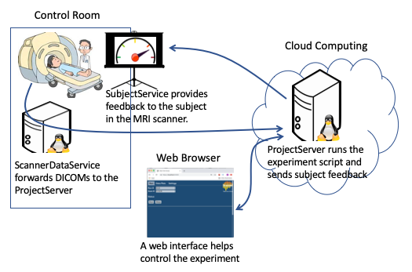
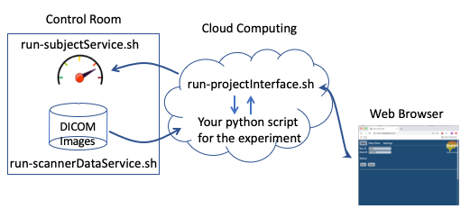

# Realtime fMRI Cloud Framework
The Realtime fMRI Cloud Framework is an open-source software package that makes it easier to build and deploy real-time fMRI experiments. The framework provides a coordination hub between the experimenter’s script, a subject feedback script, the scanner data, and experiment control. It streams scanner data (in real-time) to an experimenter’s script and forwards the results for use in subject feedback (optionally using tools like PsychoPy, jsPsych, or PsychToolbox). It provides a web-based user interface that allows for starting and stopping runs, changing settings, and viewing output. It can be configured to run in the cloud, on a cluster, or in the control room. Development was initially funded by Intel Labs; the framework is under active development with funding from NIMH to further extend its capabilities, including support for standards such as BIDS and OpenNeuro.org.

## How it works
There are four general components:
- **Data Server (ScannerDataService)**
  - Watches for new DICOM images written by the MRI scanner.
  - Sends the DICOM images to the projectInterface in the cloud.
  - Listens for requests from the cloud projectInterface to either read or write files (within restricted directories) on the scanner computer.
- **Project and Web Interface (ProjectServer)**
  - Runs in the cloud.
  - Provides a user interface to start/stop and configure a run.
  - Is the communication link between the scannerDataService and the project-specific experiment classification script that runs in the cloud.
- **Project Specific Classification Script**
  - Classification script specific to the fMRI study being done.
  - Is started / stopped by the projectInterface and runs in the cloud.
  - Waits for DICOM files to be retrieved by the scannerDataService, creates a data model, returns classification results via the subjectService or scannerDataService for feedback purposes.
- **Subject Feedback (SubjectService)**
  - Runs on the presentation computer.
  - Listens for classification results sent from the projectServer which were generated by the project-specific classification script.
  - Uses the classification results in combination with a feedback toolkit and script, such as using PsychoPy, JsPsych, or PsychToolbox, to provide feedback to the subject in the MRI scanner.

 
**Fig 1: Overview of Components** 

 
**Fig2: Overview of Where Scripts Run** 

A projectInterface is started on the cloud computer (or it can instead be run on a local or cluster computer). The projectInterface has a web interface which a browser can connect to and allows configuring and starting a run. The web interface is configured so that the browser 'start button' starts the project specific script. Wherever the projectInterface is installed is where your project specific python script will also run. The projectInterface also serves as the intermediary for communication between the the scannerDataService (running in the control room), the project specific script (running in the cloud) and the subjectService for feedback (running on the presentation computer).

A scannerDataService is started on the scanner computer that can watch for files within specified directories. The scannerDataService connects to the projectInterface using a username and password to connect and login.

A subjectService is started on the presentation computer. The subjecService listens for classification results from the project-specific script running in the cloud. These results can then be used by a presentation script to provide feedback to the subject in the MRI scanner. The subjectService connects to the projectInterface using a username and password to connect and login.

## Other Links
- [Wrapping Your Experiment Script with the RealTime Framework](docs/how-to-wrap-your-project.md)
- [Running a Realtime Experiment](docs/how-to-run.md)
- [Run Project in a Docker Container](docs/run-in-docker.md)
- [Using BIDS Data Format in RT-Cloud](docs/using-bids-data.md)

## Installation

#### **Step 1: Install Mini-Conda and NodeJS**
*On the cloud computer where processing will take place, do these steps*
1. Check if you have mini-conda already installed. In a terminal run <code>conda -V</code>
    - *Mac Specific:* [Install Mini-Conda](https://docs.conda.io/en/latest/miniconda.html)
    - *Linux Specific:* Install Mini-Conda
        - <code>wget https://repo.continuum.io/miniconda/Miniconda3-latest-Linux-x86_64.sh</code>
        - <code>bash Miniconda3-latest-Linux-x86_64.sh -b</code>
2. Check if you have Node.js and NPM installed. In a terminal run <code>node -v</code> and <code>npm -v</code>
    - **Update:** Node.js is now included in the conda environment which will be created in Step 5 below, 'Create the conda environment'
    - *Mac Specific:* Install Node.js
        - Check if Homebrew 'brew' is installed run <code>brew -h</code>
            - [Install Homebrew](https://treehouse.github.io/installation-guides/mac/homebrew) if it is not installed
        - Run <code>brew update</code>
        - Run <code>brew install node</code>
    - *Linux Specific* (CentOS): Install Node.js
        - <code>sudo yum install epel-release</code>
        - <code>sudo yum install nodejs</code>

#### **Step 2: Install Realtime ProjectInterface on cloud VM (All OS types)**
*On the cloud computer where processing will take place, do these steps*
1. Pull the source code <code>git clone https://github.com/brainiak/rt-cloud.git</code>
2. <code>cd rt-cloud/</code>
3. Get the local ip address *<local_ip_addr>*
    - *Mac Specific:* Google "what's my ip address"
    - *Linux Specific:* <code>hostname -i</code>
4. Make a private key and an ssl certificate or copy an existing one into the certs directory 
    - <code>mkdir certs; openssl genrsa -out certs/rtcloud_private.key 2048</code>
    - <code>bash scripts/make-sslcert.sh -ip *[local_ip_addr]*</code>
5. Create the conda environment 
    - <code>conda env create -f environment.yml</code>
    - <code>conda activate rtcloud</code>
6. Install node module dependencies 
    - <code>cd web; npm install; cd ..</code>
7. Create a user: 
    - <code>bash scripts/add-user.sh -u [new_username] -p [password]</code>

#### **Step 3: Install ScannerDataService and/or SubjectService on the Console and Presentation Computers (All OS Types)**
*On the console computer where DICOMs are written, do these steps*
1. Repeat Step 1.1 above to install Mini-Conda
2. Clone the rt-cloud code <code>git clone https://github.com/brainiak/rt-cloud.git</code>
3. Copy the ssl certificate created in Step 2.4 above to this computer's rt-cloud/certs directory
    - Copy rt-cloud/certs/rtcloud.crt and rt-cloud/certs/rtcloud_private.key from the cloud computer
    - Copy it into the rt-cloud/certs directory on the scannerDataService computer and subjectService computer

## Testing the Sample Project
For the sample we will run all services (the projectInterface, scannerDataService, and subjectService) on the same computer. Follow the above installation steps; the three service will be run from the same installation directory on the same computer. In a production deployment the projectInterface would typically run in a cloud VM, the scannerDataService would run on the control room console computer, and the subjectService would run on the presentation computer. 

**Note:** The --test option runs in test mode which doesn't use SSL encryption and accepts a default username and password, both are 'test'. **Never run with the --test option in production.**

1. Open a terminal
    - Start the projectInterface 
        - <code>conda activate rtcloud</code>
        - <code>bash scripts/run-projectInterface.sh -p sample --dataRemote --subjectRemote --test</code>
2. Open another terminal
    - Start the dataScannerService 
        - <code>conda activate rtcloud</code>
        - <code>bash scripts/run-scannerDataService.sh -s localhost:8888 -d $PWD,/tmp --test</code>
3. Open a third terminal to start the subjectService (where feedback is received)
    - Start the subjectService to receive subject feedback on the presentation computer 
        - <code>conda activate rtcloud</code>
        - <code>python rtCommon/subjectService.py -s localhost:8888 --test</code>
4. Navigate web browser to URL http://localhost:8888
    - If prompted for username and password enter: 
        username 'test', password 'test'
5. Alternate step 4 - Run the sample project from the command line (it will automatically connect to a local projectServer and receive data from the scannerDataService) 
    - <code>conda activate rtcloud</code>
    - <code>python projects/sample/sample.py</code>

#### Using the Sample Project with synthetic data generated by BrainIAK
1. Alternate to step 1 above
    - Start the projectInterface using the syntheticDataSample project 
        - <code>conda activate rtcloud</code>
        - <code>bash scripts/run-projectInterface.sh -p syntheticDataSample --dataRemote --test</code>
2. through 5. same as above.

## Next Steps
1. Run the sample project without the --test options. This will require the following steps. See [Running a Realtime Experiment](docs/how-to-run.md) for instructions on accomplishing these steps.
    - Add the SSL certificate *rtcloud/certs/rtcloud.crt* that was created in install step 2 above into your web browser.
    - Include the -ip [local_ip_addr] option when starting the projectInterface.
    - Include the -u [username] and -p [password] options when starting the scannerDataService. Use the username and password created in install step 2 above.
    - Navigate web browser to http**s**://localhost:8888 for a SSL connecton
        - i.e. instead of the non-SSL http:// address used above for testing
    - When prompted for login by Web browser use the username and password created in install step 2 above.
2. Install and run the projectInterface on a remote computer. Run the scannerDataService on the computer where the DICOMs are written.
3. Create your own project python script and wrap it with the real-time framework. See [Wrapping Your Experiment Script with the RealTime Framework](docs/how-to-wrap-your-project.md)

## Troubleshooting
1. Python module not found - make sure you have installed and activate the conda environment: 'conda activate rtcloud'. See installation step 2.5 above.
2. Web page gives a blank blue screen - the web javascript bundle wasn't built, 'cd web; npm install; npm run build'. See installation step 2.6 above.
3. ScannerDataService or subjectService can't connect to the projectInterface.
    - Try specifying the '--test' option to all components (projectInterface, scannerDataService, subjectService). This will disable ssl and allow login with a test user, username: test, password: test. The web page will now be at http://localhost:8888 (*not https://*)
    - Make sure the projectInterface computer's firewall has port 8888 open. Try using an ssh tunnel if in doubt, 'ssh -N -L 8888:localhost:8888 [remote-computer]'
    - Try running the scannerDataService on the same computer as the projectInterface to test the connection.
    - Try using a different port, specify the '--port [new_port]' option when starting the projectInterface and when starting the scannerDataService specify the appropriate port using -s [remote-computer]:[port].
    - Make sure the ssl certificate and private key (rtcloud.crt and rtcloud_private.key) that were created on the projectInterface computer have been copied to the rtcloud/certs directory on the scannerDataService and subjectService computers.
    - Make sure you have created a username and password using the 'scripts/add-user.sh' script.
4. ProjectInterface cannot find your experiment script. Make sure your script's name matches the project directory. Or specify the '--mainScript [script-name]' option when starting the projectInterface. In addition the '--initScript [init-script]' and '--finalizeScript [finalize-script]' options can be used to specify the session initialization and finalization scripts.
5. ProjectInterface or web page indicate 'RemoteServie: DataService not connected'. This means you started the projectInterface using the --dataRemote option but that a scannerDataService has not established a connection to the projectInterface, so it cannot make remote requests for data. Similarly for 'SubjectService not connected' errors.
6. An error in your script. Try running your script without starting the projectInterface. The clientInterface() method called by your script will create an internal version of the data services if there is no projectInterface started on localhost. If you specify yesToPrompts=True when instantiating the clientInterface (ClientInterface(yesToPrompts=True)) it will automatically use local services if there is no projectInterface running.

## Further Reading
- [Run Project in a Docker Container](docs/run-in-docker.md)
- [Details](docs/details.md) - coming soon

Expand Item

    More items here

