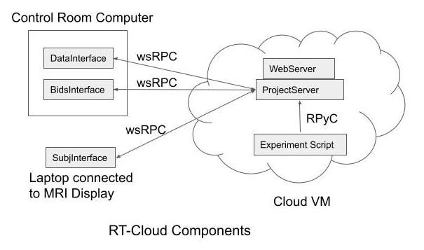

# Information and Overview for Developers

### **Software Tests**
There is an extensive set of software tests in the ```rt-cloud/tests/``` directory that use the pytest framework. To run the tests from the rt-cloud directory use command:

    conda activate rtcloud
    npm install -g bids-validator  # first time only

    python -m pytest -s -v tests/

### **Web Interface**
The projectServer runs a Tornado web server, launched from within module ```rt-cloud/rtCommon/webServer.py```. This web server provides url endpoints for the main webpage /index.html, and for various websocket interfaces such as wsData, wsSubject, and wsUser for sending and receiving commands. The main web page (index.html) loads a javascript bundle that uses React to create the webpage that the user interacts with.

The web interface source code is in the ```rt-cloud/web/``` directory. The javascript code that is used to render the main webpage is in the web/src/ directory. There is essentially one javascript file per panel (tab) shown on the main webpage. Before building the javascript bundle for the first time, the npm packages must be installed. The installation and build specifications are provided to npm through the package.json file.

    conda activate rtcloud
    cd web/
    npm install

From then on, the javascript bundle can be built with command:

    npm run build

### **Debugging**
When debugging issues it is often convenient to use the Python Debugger (pdb). You can cause any script to stop and provide a debugger prompt by inserting the following code at any point in a python module:

    import pdb; pdb.set_trace()
From the debugger prompt you can press:

- (c) - continue execution of script
- (n) - next, execute the next line of the script
- (s) - step, step into the function call of the next line
- (p) - print a variable
- (b) - breakpoint - set a breakpoint at a line

More details on [python debugger](https://docs.python.org/3/library/pdb.html#debugger-commands)

### **Software Overview**

**Functional Description:**
The projectServer is the central control point within the system. It serves as a communication hub linking components. For example, it is the intermediary that receives brain scan volumes, forwards those to the model processing script, returns classification feedback results, and provides researcher user controls through a web interface.

The webServer is part of the projectServer that provides user control and feedback, but it also is a communication hub accepting secure web socket (WSS) connections for data transfer and subject feedback. This is convenient because the same web port and ssl certificate can be used for all forms of network communication.

**Interfaces and Services:**
Various utilities and functions are provided by the rt-cloud framework for use by the experiment specific scripts. For example, functions that allow watching for Dicom data to be written by the scanner, and many others. These functions are provide in python modules, such as dataInterface, subjectInterface and bidsInterface. These modules can be loaded directly by the experiment script and used, however most often these module need to run remotely and accessed via connection to the projectServer.

For example, the dicom data typically arrives at the control room computer, and so we want the dataInterface to run on that computer and connect to the projectServer to provide remote access to the experiment script.

If the module is running remotely we call it a service, and the service connects to the projectServer via a websocket and receives commands to run functions and return results. From within the experiment script it just makes normal function calls to these interfaces, and depending on the configuration, those calls can be transparently forwarded to the remote service for processing.

So from a high-level, rt-cloud provides sets of functions for the experiment script to use. Some related to getting and putting data (dataInterface) and some related to setting classification results (subjectInterface), and others. Those functions can be run locally with the experiment script by simply importing the modules. However, if the data or presentation is on a remote computer then these functions need to run remotely. In that case we wrap the functions (dataInterace, subjectInterface etc) within a service that houses the functions and makes a websocket connection to projectServer. Then when the experiment script makes a function call to one of these services, it is packaged into a network message, send to the service to be run, and the results returned back to the experiment script (all transparent to the script).

**Other Interface Details**

The dataInterface (formerly fileWatcher) is a component for getting/putting/listing and watching for files. It's main task is to watch for the creation of Dicom files on MRI scanner filesystem, and then read and forward those to the projectServer for processing. Other related components are a bidsInterface for returning volumes in BIDS format. And an OpenNeuro interface for retrieving and replaying OpenNeuro data.

The subjectInterface provides a data queue which the experiment script can push classification results onto, and the presentation script can pop results off from, in order to provide feedback to the subject in the MRI scanner. This can also be incorporated into tools such as jsPsych or psychoPy.

The BIDS data modules allow converting a stream of Dicom images to a BIDS stream and other BIDS related functions like creating a BIDS archive from the data.

**Configurations:**

System configuration is handled through a toml file that is provided via the projectServer along with the experimenter’s script. This has settings that can be configured by the researcher that are used by the experiment script.

The paths to the experiment script and configuration files are provided to the projectServer so it can start the script as a separate process and forward data and communications to it.


**Where Interfaces Run:**

Interface objects can be instantiated in one of 3 places. 1) Within the experiment script directly. In this case there is no projectServer needed and no remote communication. 2) Within the projectServer - In this case the functions are run within the projectServer and the results returned to the script via RPyC. 3) At a remote computer (i.e. a remote service) - In this case the interface functions are run at the remote computer and the experiment script's request to run a command is packaged into a network message and sent to the remote service, which then runs the function corresponding to the request and returns the result.

**Remote Communication Between Components** -
Expanding on the 3 options:
1. Local Only Case: when no ProjectServer is used. In this case all interfaces run locally within the same process as the researcher's script (such as dataInterface, subjectInterace etc). In this case there are no RPyC or wsRPC (WebSocket RPC) hops involved and ```clientInterface.isUsingProjectServer() == False``` and ```dataInterace.isRunningRemote() == False```.

2. ProjectServer with local services: The data and/or subject services run on the same computer and in the same process as the ProjectServer (note that one service could be local and another remote). In this case there is a RPyC hop from the researcher's script to the ProjectServer, but no wsRPC hop from there to a remote service. The interface's isRunningRemote() function will return False (such as dataInterface.isRunningRemote()), indicating that the interface or service is running on the same computer as the ProjectServer. In this case ```clientInterface.isUsingProjectServer() == True```, but ```dataInterace.isRunningRemote() == False```. A rpc_timeout parameter can be supplied as an extra kwarg to function call to increase the RPyC timeout for that call.

3. ProjectServer with remote services: The data and/or subject services are running on different computers from the ProjectServer (note that one service could be remote and another local). In this case there is a RPyC hop from the researcher's script to the ProjectServer, and a wsRPC hop from the ProjectServer to the remote services. The ```clientInterface.isUsingProjectServer() == True```, and ```dataInterace.isRunningRemote() == True```. A rpc_timeout can be supplied as an extra kwarg to function calls to increase both the RPyC and wsRPC timeouts for that call.

<!--
There are 2 broad types of components, *Interfaces* and *Services*:
1. Interfaces: These are sets of functions that the experiment script can call. They provide functionality to the script such as getting data, sending classification results, setting information on the web page. These are implemented by a class in a python module where the class functions implement logic (code) for the interface.
2. Services: These are processes which provide the instantiated *Interface* that the experiment script calls. For example a dataService would instantiate a dataInterface object and receive requests from an experiment script to run a function and return the results.
-->

### **Questions and Answers**
**Q:** Regarding setResult, what is the use case for this? Is this for direct interface w/ PsychoPy or jsPsych? (is an alternative to just write a text file which gets read by the presentation software?). For using dequeueResult directly in PsychoPy — how does that work? Just import rtCommon subjectInterface.py and using the dequeueResult function?
- **A:** setResult puts the classification result into a queue that can then be read by the presenter script with dequeueResult (perhaps would be better named as getResult). DequeueResult could be used within PsychoPy scripts directly. The subjectService can also be run with -o (--outputDir) flag in which case it will write out text files with one result per file which can then be watched for and read in by a PsychToolbox script. For using dequeueResult in PsychoPy, import subjectService.py module into your script, then instantiate a SubjectService object (the _init_ function of that will connect to the projectServer and start receiving results). Then put some logic such as in the while loop of the _main_ function of that module that dequeues results and can block until a result is ready.

**Q:** When you refer to “experiment script” that refers to something like sample.py right? Regarding the 3 ways to run the interfaces, how does the experiment script need to change depending on which method is being used (or is that handled automatically based on how the scripts were initiated in terminal?)
- **A:** Yes, by experiment script I mean like sample.py (or the model/classification script running typically on the cloud computer) - perhaps there is a better term for this, I’ve struggled to figure out what to call it.
The experiment script doesn’t need to change anything to use the 3 ways of interface. When the experiment script instantiates the clientInterface, that module will try to connect to the projectServer. If it can’t connect they it runs in method 1 (all local). If it can connect then if method 2 or 3 is used depends on how the projectServer was started, i.e. with --dataRemote (--subjectRemote) or not.

**Q:** I’m not sure i understand the difference between “ProjectServer with local services” and “ProjectServer with remote services”. (Especially because earlier in this document you say that if a module is running remotely then you call it a service — so i thought service means “remote”, but here you refer to local vs remote services)
- **A:** The projectServer and the experiment script always run on the same computer, this is baked into the code that the clientInterface is only allowed to make a localhost connection to the projectServer (for security reasons). So whether the dataInterface is running within the experiment script (case 1) or in the projectServer (case 2) it is still local to the computer that the experiment script is running on, so in that sense the data is local to the script.

**Q:** Even if I am just testing things out (using --test flag) by running two terminals on my local machine, one as projectServer + dataService, the other as subjectService, I still need to have a valid ssl cert? and I cant test out the exporting of text files with dequeueResult via the outputDir flag unless I am using a “remote” subjectservice right?
- **A:** You don’t need an ssl cert with --test flag, but you must specify --test for each process you start (the subjectInterface as well as projectServer).
Yes, you need a remote subjectService to test the writing of text files.

**Q:** What if I want to output a text file at the end of each run (or something like combining results across 2 runs and saving that output) — setResult seems to expect a currentRun and currentTR as input?
- **A:** You can use the setResultDict() function and set any results you want within the dictionary. The subjectService.py is just an example of how it could be used. So you could set data at the end of a run or at the end of several runs.

**Q:** What is the point of onsetTimeDelayMs in setResult? is it that if I wanted, in psychopy, to wait half a second before updating the stimulus based on the classification results, i would set 500 ms here?
- **A:** The onsetTimeDelayMs is meant for cases you want to synchronize the feedback stimulus with the start of a TR, such as when the projectServer knows the timestamp information when TRs start.


**Q:** What’s the difference between initWatch and initScannerStream?
- **A:**  initWatch and initScannerStream both accomplish the same thing. We originally had the initWatch/watchFile interface. Then we added a more “streaming” interface with BIDS and the initScannerStream/getImageData is that. So the BIDS interface uses initScannerStream internally, but it can also be used for a Dicom stream. I would say use the initScrannerStream interface and consider the initWatch as deprecated (or for backward compatibility).

**Q:** Can I have the experiment script execute different code dependent on a subject’s button press? if so how would i let the experiment script have access to that information of what/if the subject pressed a button?
- **A:** There is some support for getResponses, and I made an example in the jsPsych feedback. For PsychoPy the subject responses would need to be queued and returned whenever the experiment script calls getResponse or getAllReponses. So the stubs are there, it just needs to be filled out some.

**Q:** How can I can test the VNC Viewer locally? Can I run the DISPLAY=:1 code in the experiment script file?
- **A:** You can install tigervnc and the websocket conda environment. See instructions [here](https://rt-cloud.readthedocs.io/en/latest/how-to-run.html?highlight=vnc#install-vnc-server-on-the-projectserver-computer).
The scripts/run-vnc.sh will then start the vnc server and create a websockify wrapper that allows websocket connections to the normally TCP only based vnc server.

Other Notes from discussion:
- How can I change the experiment script based on button presses? Answer: currently only implemented in javascript version of subjectinterface via getAllResponses(); not implemented in python subjectinterface yet; probably not good idea to go from control room machine to cloud directly.
- we also talked about some vnc viewer specifics — needs its own installation, new conda environment, etc
- also talked about how you cant easily view analyzed data on the control room machine (going from cloud back to the control room to bypass using VNC viewer), or you can depending on your MRI Center’s setup but we want rtcloud to be workable regardless of the setup
you can potentially bypass VNC Viewer by encoding the image you want to look at into a dictionary and sending that through to the presentation laptop, but at that point its probably not worth it compared to the initial setup cost of doing VNC viewer route
