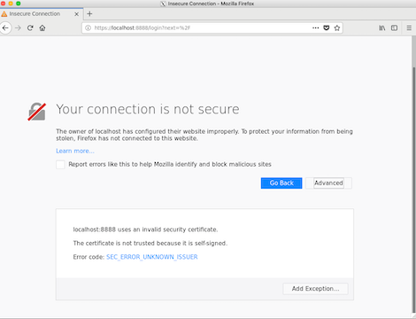
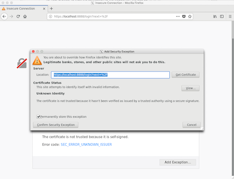

# **Running a Realtime Experiment**

## **Running the ProjectInterface**
The projectInterface is typically run on a VM in the cloud (i.e. a 'remote' computer) which does not have direct access to the DICOM images. The advantage of a cloud VM is that any laptop browser can connect to it and no additional hardware or software installation is needed on the control room computer. However the projectInterface can also be run on a 'local' computer, meaning on the same computer in the control room where the DICOM images are written.

### **Running ProjectInterface in the Cloud**
**1) Start the projectInterface** 
From the cloud VM computer run the following command. See [Definitions Section](#Definitions) for description of the parameters.

    cd rtcloud/
    conda activate rtcloud
    bash scripts/run-projectInterface.sh -p [your_project_name] -c [config_file] -ip [local_ip_addr] --dataRemote --subjectRemote

Example:

    bash scripts/run-projectInterface.sh -p sample -c projects/sample/conf/sample.toml -ip 125.130.21.34 --dataRemote --subjectRemote

The -p option is used to locate your project in the */rt-cloud/projects/* directory, the name specified should match your project directory name.

The -c option points to your project configuration file in toml format.

The -ip option is to update the ssl certificate with the ip address where the projectInterface runs. Use 'hostname -i' or Google 'what's my ip address' to get the ip address of that computer.

**2) Start the scannerDataService** 
The scannerDataService is started on the control room computer where the DICOM images are written by the scanner. It can forward those images to the projectInterface when requested by your project code. The *[username]* and *[password]* are the login credentials to the projectInterface because the scannerDataService must connect to the projectInterface to be able to serve files to it.

    bash scripts/run-scannerDataService.sh -s [projectInterface_addr:port] -d [allowed_dirs] -f [allowed_file_extensions] -u [username] -p [password]

Example:

    bash scripts/run-scannerDataService.sh -s 125.130.21.34:8888 -d /tmp,/data/img -f .dcm,.txt

**3) Start the SubjectService** 
The subjectService is started on the presentation computer where PsychoPy or similar software will run to provide feedback to the subject in the MRI scanner. The *[username]* and *[password]* are the login credentials to the projectInterface because the subjectService must connect to the projectInterface to be able to receive classification results.

    bash scripts/run-subjectService.sh -s [projectInterface_addr:port] -u [username] -p [password]

Example (run from the rt-cloud directory):

    bash scripts/run-subjectService.sh -s 125.130.21.34:8888 -u user1 -p passwd1

### **Running ProjectInterface Locally**
The projectInterface can also be run on the control room computer where the DICOM images are written. This is called running it 'locally'. When run locally the fileServer (scannerDataService) is not needed because the projectInterface can directly read the DICOM images from disk.

**1) Start the projectInterface:** same command as above but without the --dataRemote or --subjectRemote options

    bash scripts/run-projectInterface.sh -p [your_project_name] -c [config_file] -ip [local_ip_addr]
Example:

    bash scripts/run-projectInterface.sh -p sample -c projects/sample/conf/sample.toml -ip 125.130.21.34

## **Connecting with the Browser**
### SSL Certificate Installation
The connection between your web browser and the projectInterface is encrypted using SSL for security. In order for your browser to trust the connection to the projectInterface, the SSL certificate created during the projectInterface installation process must be added to a list of trusted certificates on your browser computer.

Copy the ssl certificate **rtcloud/certs/rtcloud.crt** to your computer running the web browser.

#### Install the SSL Certificate in your Web Browser
**On Mac:**
1. Open application 'Keychain Access'.
2. Click on 'Certificates' in bottom left pane
3. Select File->Import Items... and select the ssl certificate downloaded to your computer
4. In 'Certificates' pane, double-click the 'rtcloud.princeton.edu' certificate
5. Select the 'Trust' drop-down item.
6. In 'When using the certificate' selector choose 'Always Trust'

**On Linux:**
1. Navigate to the projectInterface web URL, e.g. https://localhost:8888
- You will see a security warning about untrusted certificate

- Click 'Add Exception'
- You will see a dialog box 

- Click 'Confirm Security Exception'

### Open Web Page in Browser
1. Open a browser and navigate to **https://<projectInterface_addr>:8888**
2. On the login screen enter the **[username]** and **[password]** that were created during installation by the adduser.sh script

### Notes on Security
There are several security mechanisms
- **Encryption** - Using SSL connections means all data is encrypted in transit.
- **Password** - A username and password mean that only authorized users can connect to the projectInterface.
- **Restricted directories** - The fileserver restricts which directories it will return files from.
- **Restricted file types** - The fileserver restricts which file types (denoted by the file extension, e.g. .dcm) it will return.
- **Direction of connection** - The fileserver doesn't allow connections to it. The fileserver always initiates the connection going to the projectInterface.

## Definitions
- **[allowed_dirs]** - This allows restricting which directories the fileServer is allowed to return files from. Specify as a comma separated list with no spaces, e.g. '-d /tmp,/data,/home/username'
- **[allowed_file_extensions]** - This allows restricting which file types the fileServer is allowed to return. Specify as a comma separated list with no spaces, e.g. '-f .dcm,.txt,.mat'
- **[config_file]** - the location of project specific configurations in a toml file format. This will typically be located in a directory within the project such as *rtcloud/projects/your_project/conf/*. E.g. the sample project config file is *rtcloud/projects/sample/conf/sample.toml*
- **[local_ip_addr]** - network address of the computer where a command is issued
    - Get the local ip address
        - Mac: Google "what's my ip address"
        - Linux: <code>hostname -i</code>
- **[username] [password]** - The username and password to login to the projectInterface. This was created with the adduser.sh script during installation of the projectInterface.
- **[projectInterface_addr:port]** - The network address and port number that the projectInterface is listening on. The default port is 8888. E.g. '-s 125.130.21.34:8888'
- **[your_project_name]** - The name of the subdirectory under the *rtcloud/projects/* directory which contains your project specific code. Your script should use the same name as the directory, i.e. sample.py, so that the projectInterface can find it.
- **[run]** - An fMRI scanner aquisition block of images. For example running the scanner to collect a block of 200 scans with a TR image repetition time of 2 seconds; this run will take 400 seconds and generate 200 DICOM images.
- **[scan]** - The file sequence number corresponding to a run. For example, in the image name '001_000014_000005.dcm', the scan number is 14 and the image volume number (TR id) is 5.
