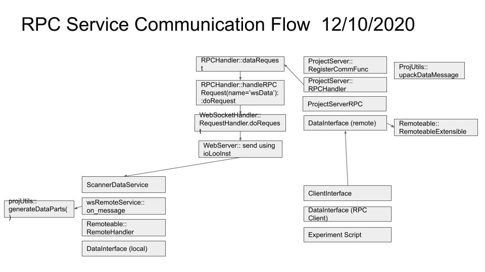
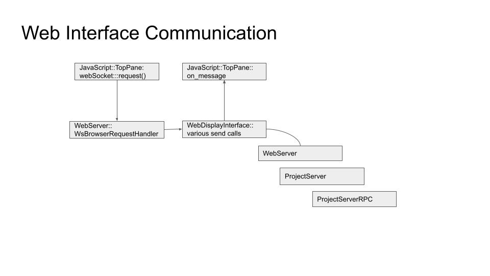
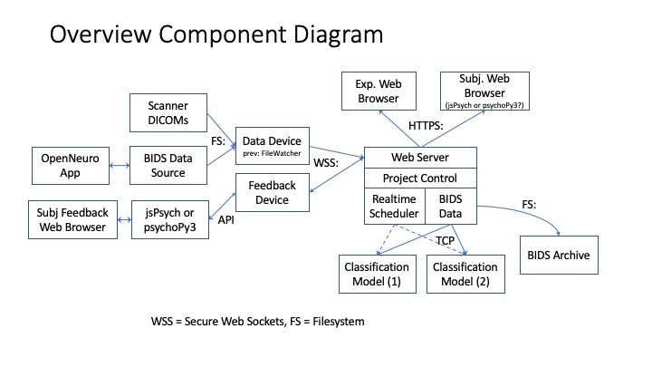
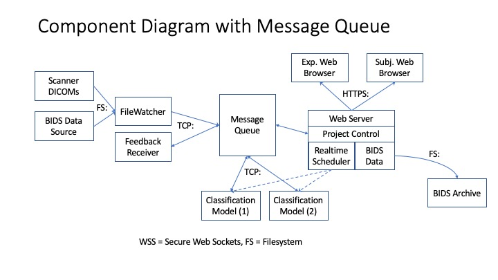

## Real-Time fMRI Framework Software Architecture

### Summary:
Real-time fMRI feedback enables novel experimental paradigms and clinical treatments, but the cost and complexity of using it has inhibited wider adoption. This framework handles all infrastructure requirements for running real-time fMRI neurofeedback experiments and treatments in the cloud, requiring only a single experiment/treatment code file from researchers or medical professionals.

### Design Description:
#### Requirements / Goals:
- Make experiments easy to set up and run
    - Accept experiment-specific code as input
    - Abstract away distributed nature of system (multiple containers)
    - Handle networking and data conversion aspects
    - Include web UI for researchers to manage experiments in real time
- Make experiments cloud-accessible
    - Containerized deployment
    - Expose web UI from cloud
    - Anonymize and secure data in rest and in transit
    - Cloud agnostic
    - Provide hardware monitoring features? (e.g., CPU load too high, upgrade your cloud VM hardware to run your experiment at required speeds)
    - Support download & storage of BIDS archive at any point
- Support BIDS data format
    - Maintain growing BIDS archive
    - Accept BIDS-I as input to processing pipeline
    - Convert DICOM->BIDS-I, BIDS-I->BIDS, BIDS->BIDS-I
    - Enable analysis on both incoming images and full dataset so far
- Support BIDS app format
    - Modify behavior with standardized BIDS app CLI arguments
- Develop & maintain tutorials/FAQs for users
- Create sample set of pre-packaged experiments for immediate use
    - Create experiments to validate the framework and provide a starting point for other researchers
    - Experiments are immediately deployable
- SaaS (web enabled) - application is accessible from a web browser
    - Including both experimenter view and subject feedback view
- Run projectServer locally or remotely
- Retrieve files locally or remotely
- Provide subject feedback
    - Via web server
    - Via numeric response used by another tool such as PsychoPy or PsychToolbox
- Collect subject button box responses and return to experiment script or store
- Replay previously collected data
    - Connect to OpenNeuro BIDS app to replay data

#### Non-Requirements:
- Command line interface. Ability to run a project in the cloud from a remote laptop command line

### User Stories:
#### *Neuroscience Researcher building and experiment:*
A researcher writes python scripts specific for their study to do both classification and subject feedback. The RT-fMRI framework provides the main pipeline for transferring data and results and for controlling the experiment via a web interface. They use the integrated system either in the cloud or running locally to conduct their experiments.

#### *Neuroscience Researcher reviewing or testing prior experiments:*
A researcher replays previously collected data through original or new processing scripts in order to learn or improve upon prior experiments.

#### *Clinician:*
A clinician uses a pre-created experiment to provide treatment to a patient. They access the experiment, which is running in the cloud, via a web browser. They enter configuration data and start/stop the runs and collect the results.

### Functional Description:
The projectServer is the central control point within the system. It serves as a communication hub linking components. For example, it is the intermediary that receives brain scan volumes, forwards those to the model processing script, returns classification feedback results, and provides user controls through a web interface.
Considerations: What communication protocols to use, i.e. WSS, HTTPS, TCP, Pipes, etc.

The webServer is part of the projectServer that provides user control and feedback, but it also is a communication hub accepting secure web socket (WSS) connections for data transfer. This is convenient because the same web port and ssl certificate can be used for all forms of network communication.

The fileWatcher is a component that watches for the creation of MRI scan files on a filesystem, then reads and forwards those volumes to the projectServer for processing. Other related components are a bidsInterface for returning volumes in BIDS format. And an OpenNeuro interface for retrieving and replaying OpenNeuro data.

The subjectInterface receives classification results from the projectServer to provide feedback to the subject in the MRI scanner. This is also incorporated into tools such as jsPsych or psychoPy.
TODO: How are the subject responses collected and returned

The experimenter’s script. The path to the script is provided to the projectServer so it can start the script as a separate process and forward data and communications to it.
TODO: how to easily upload script from laptop to projectServer

Configuration file. This needs to be easily edited and provided to the projectServer along with the experimenter’s script. Ideally editing it from their laptop or the web interface and then having those settings take effect when the projectServer runs the experiment script.

The BIDS data module provides for handling BIDS data and creation of BIDS archives from the data.

The real-time scheduler starts and stops the classification modules, monitors response time and provides for alternate responses if deadlines will be missed.

### Remote Communication Between Components
There are 3 remote configuration options:
1. Local Only Case: when no ProjectServer is used. In this case all service interfaces run locally within the same process as the researcher's script (such as dataInterface, subjectInterace etc). In this case there are no RPyC or wsRPC (WebSocket RPC) hops involved and clientInterface.isUsingProjectServer() == False and dataInterace.isRunningRemote() == False.

2. ProjectServer with local services: The data and/or subject services run on the same computer and in the same process as the ProjectServer (note that one service could be local and another remote). In this case there is a RPyC hop from the researcher's script to the ProjectServer, but no wsRPC hop from there to the local service. The interface.isRunningRemote() will return False (such as dataInterface.isRunningRemote()), indicating that the interface or service is running on the same computer as the ProjectServer. In this case clientInterface.isUsingProjectServer() == True, but dataInterace.isRunningRemote() == False. A rpc_timeout parameter can be supplied as an extra kwarg to calls to increase the RPyC timeout for that call.

3. ProjectServer with remote services: The data and/or subject services are running on different computers from the ProjectServer (note that one service could be remote and another local). In this case there is a RPyC hop from the researcher's script to the ProjectServer, and a wsRPC hop from the ProjectServer to the remote services. The clientInterface.isUsingProjectServer() == True, and dataInterace.isRunningRemote() == True. A rpc_timeout can be supplied as an extra kwarg to calls to increase both the RPyC and wsRPC timeouts for that call.

 

 

### Design Considerations
### Communication Design Considerations:
Two communication design options are presented below, option 1 was chosen for implementation as the simpler to set up, use and debug.
### Option 1: The projectServer serves as a communication hub between components. (Implemented)
 
Uses secure web sockets (WSS) for communication between fileWatcher and projectServer. Uses HTTPS for communication to web interfaces.
#### Advantages:
- Only need to open one port through firewall (web server port)
- Fewer components that need to be started or kept running
- Easier or to debug if something crashes or is not working

### Option 2: A message queue serves as the communication hub between components
 
The message queue is the intermediate for all communication between components
#### Advantages:
- Eliminate routing of data within project control module
- Connections always alive (to the queue)
- Multi-channel, multiple-components can subscribe to queues.
#### Disadvantages:
- More components that need to be running / kept running for system to work
- More difficult to debug for user if something goes wrong

### Communication Protocols:
#### Pros and Cons of TCP, WebSockets, RPC
- Pros and Cons of TCP:
    - Can initialize a connection in either direction (Yale connects from cluster to control room)
    - Requires another port be opened (besides the web port)
    - Can use web server SSL key (but does client require private key?)
    - How to require a user/password login
    - Need to send the connection type, i.e. data or subject etc.

- Pros and Cons of RPC:
    - Requires a separate connection port from web based port (unless it can use web sockets as the transport layer)
    - Primarily supports one direction communication (requests to the remote). But rpyc can support reverse calls as well.
    - Potentially easier to set up and reason about, keeps code cleaner

### Implementation Thoughts
- RPC (rpyc) between experimenter script and projectServer - restrict to local connections only for security and because the researcher script will always run on the same computer as the projectServer.
- Some sort of RPC between the projectServer and both scannerDataService and SubjectInterface.
    - However must be able to use from javascript also (i.e. web page or jsPsych)
    - Perhaps a custom RPC. Gather the function name and args in a message, the receiver converts func name into a callable and calls it with the args, returning the results.
    - Perhaps FileInterface class can be used at the RPC controlroom end with modifications to check for allowed filetypes and directories under certain conditions. Maybe those checks are done by the RPC handler before the FileInterface is called.
    - However we need a revised class, see ControlRoomInterface above, that handles the RPC requests.
    - Should it be multi-threaded to handle multiple clients, or async requests?
    - Same sort of idea for SubjectInterface
- Realtime scheduler
    - If each script is calling getImage for the same scanner image, it would be wasteful to go through RPC for each. Some sort of caching mechanism for recent requests? Some way of broadcasting requests to all running models, i.e. if multiple same requests come in before any result is returned?

#### Thoughts after testing communication frameworks:
- gRPC - This is rather complex and generates a ton of underlying code to handle the RPC calls and you end up with a stub object and making calls from it passing in protocol buffer structs with all the variables in the struct. I don’t really think this complexity buys us much. We could still use protocol buffers without the gRPC interface and just send messages with the protobufs including which function to run on the other side. This is essentially what gRPC does but without the complexity of compiling and extra code. The c++ compile line needs to include so many libraries (not that we’d use c++ here).
- zeroMQ - this code looks just like regular networking code sending messages but had built-in different topologies such as 1-many, pub-sub, distributed request etc. I think for simple request-reply we might as well use a websocket connection and send a serialized message.
- Nanomsg - similar to zeroMQ with same arguments for/against
- Apache Thrift - this could be cool if it could be integrated into tornado.web application, and there is some limited information that it might be possible, but again, maybe easier to just send a message with a func field and args payload.
- Also, the advantage of going through websockets is no extra port needs to be opened and we get encryption through the ssl credential. The other packages don’t have consistent encryption solutions, or they seem hodge-podge.
