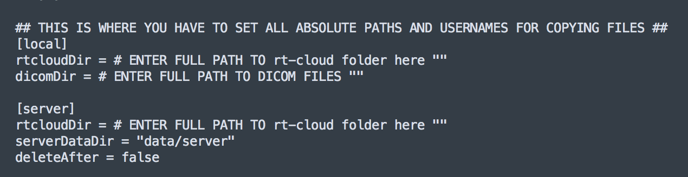

# Guide for rt-fMRI Sample Project AmygActivation

## Table of Contents
* [Overview]()
* [Installation]()
* [Setup: one computer, with the local setting]()
* [Setup: one computer, without the local setting]()
* [Setup: one local computer and one server computer]()
* [Using the web browser]()
* [Running the display]()
* [Permissions between computers]()
* [Notes]()

## Overview
### FaceMatching - amygActivation

Young 2014 run struture:
- blocks of rest, happy, count each 40 seconds
- continuous feedback during the whole happy block
- no feedback condition - same happy task but no feedback
- we're going to have even/odd judgements instead of counting down - so it's not stressful
- 13 blocks of 40 seconds each = 520 seconds (347 TRs) - put 10 TRs - from first trigger and then 5 at the end
- 362 TRs total
- let's make them 42 seconds each for the TRs to be right --> 379 - TRs total

## Installation

1. Make sure you have the rt-cloud set up on any/all computers where you want to run the software (we recommend trying everything locally first)
2. Clone the project code
    - Open terminal
    - Navigate to rt-cloud/projects directory

        ```
        cd $~/rt-cloud/projects
        ```

    - Clone from github

        ```
        $git clone https://github.com/amennen/amygActivation.git
      ```

<!-- https://zenodo.org/record/3862783#.XvIxvi-z124 -->
<!-- https://zenodo.org/record/3862783#.Xs_nchNKiu4 -->
3. Download the [dicom data (on zenodo)](https://zenodo.org/record/3862783#.XvIxvi-z124)

    - Move the data on your local computer wherever you want the “dicomDir” to be. I recommend `~/tmp/dicomDir`
        - Note: if you put it in `/tmp` it will be deleted automatically!

4. Update the configuration file depending on where the server and local computer are
    - Make a new version of the configuration file for you to edit

      ```
      $cd amygActivation
      $cp conf/sampleCfg.toml amygActivation.toml
      ```

    - Edit the new configuration file. To run the sample data, all you need to do is change the paths at the bottom of the configuration file.

    


        - [local] section: this is where you need to state the local paths
            1. rtcloudDir: this is the full path where the rt-cloud code is saved on the local computer
                - rtcloudDir = “/Users/USERNAME/rt-cloud/”
            2. dicomDir: this is the full path where the DICOM images are saved (or would be sent from the scanner). The name of folder is made automatically, so you just have to enter the general path that is constant.
              - dicomDir = “/Users/USERNAME/tmp/dicomDir/”
        - [server] section: this the where you need to state the server paths for where data processing will actually be completed
            1. rtcloudDir: same as above, but on the server computer
            2. serverDataDir: this specifies how server data will be saved, within the project folder. If you leave it as “data/server”, then the server data would save in rt-cloud/projects/amygActivation/data/server when run on the cloud.
            3. deleteAfter: this tells the finalize.py (or finalize button) whether or not to delete the entire subject folder on the server computer when running the finalize script. Leave this as false until you are sure that the right folder will be deleted!!
    - If you’re going to use local processing
        - Set the rtCloudDir to be the same local rt-cloud directory
    - If you’re going to use remote processing
        - Make sure to change the rtcloudDir to be the cloud directory. And to make sure to have this config file on the cloud server as well.


## Setup: one computer, with the local setting

In this case, you don’t need the file server at all, because the project will do all processing within one computer. Thus, you only need to start the web server.

1. Start the web server
    - Open terminal and go to the rt-cloud directory

      ```
      $cd rt-cloud
      ```

    - Activate the rt-cloud environment

      ```
      $conda activate rtcloud
      ```

    - Run the projectInterface script, giving it the correct project

      ```
      bash scripts/run-projectInterface.sh -p amygActivation -c projects/amygActivation/conf/amygActivation_local.toml --localfiles
      ```

        1. The -`-localfiles` flag sets the `args.filesremote` to be true in all subsequent project code (default is false)
        2. The `-c`  input tells the web server which config file to use in all subsequent code. It is very important to put the correct config file that you edited here. I would suggest making multiple config files with the different settings so you can just change it here when you’re running in different ways.
2. Go to the web browser to run the experiment
    - Go to [https://localhost:8888/](https://localhost:8888/login?next=%2F)
    - Login with your username from rt-cloud installation


## Setup: one computer, without the local setting

This will help test to see what the rt-cloud system does. Even though everything will be performed on one computer, it will still set up a separate data/server directory for cloud processing. This will help understand the separation between computers.

1. Start the web server

    - Open terminal and go to the rt-cloud directory

      ```
      $cd rt-cloud
      ```

    - Activate the rt-cloud environment

      ```
      $conda activate rtcloud
      ```

    - Run the projectInterface script, giving it the correct project

      ```
      bash scripts/run-projectInterface.sh -p amygActivation -c projects/amygActivation/conf/amygActivation_local.toml
      ```

2. Start the file server

    - Open another terminal window and go to the rt-cloud directory

      ```
      $cd rt-cloud
      ```

    - Activate the rt-cloud environment

      ```
      $conda activate rtcloud
      ```

    - Run the fileserver scrip

      ```
      bash scripts/run-fileserver.sh -s localhost:8888 -d /Users/USERNAME/tmp/dicomDir,/Users/USERNAME/rt-cloud -u USERNAME -p PASSWORD -f .txt,.h5,.gz,.dcm,.mat
      ```

        1. -s server means that you’re using the localhost only
        2. -d states the allowed directories on that computer (full paths, no quotations, separated by a comma)
        3. -u gives the username that you set up for the rt-cloud software
        4. -p gives the password that you set up for the rt-cloud software
        5. -f states ALL of the allowed file types to transfer from the local computer to the remote computer


3. Go to the web browser to run the experiment

4. Go to [https://localhost:8888/](https://localhost:8888/login?next=%2F)

5. Login with the same -u and -p that you put in to the fileserver script

## Setup: one local computer and one server computer

1. Computers you will need
    - Local computer: this has the dicomDIr and runs the display
          1. This computer will only handle sending dicoms to the server and running the display
          2. For convenience, I will assume that this is also the computer where you will be connecting to the web browser. In principle, you can connect to the web browser from any computer with correct permissions.
          3. You will need the IP address of this computer to connect between computers (see rt-cloud installation instructions)
    - Server computer:
          1. You will need to have login access and rt-cloud installed on this computer
          2. This is where you will run runProjectInterface:
              1. This will run the web server AND run the actual processing script
          3. You will need the IP address of this computer. I will call this SERVER_IP
2. SERVER COMPUTER: Start the web server
    - Open terminal and go to the rt-cloud directory

      ```
      $cd rt-cloud
      ```

    - Activate the rt-cloud environment

      ```
      $conda activate rtcloud
      ```

    - Run the projectInterface script, giving it the correct project, config file, and IP address

      ```
      bash scripts/run-projectInterface.sh -p amygActivation -c projects/amygActivation/conf/amygActivation_cloud.toml -p amygActivation -ip SERVER_IP
        ```

3. LOCAL COMPUTER: Start the file server
    - Open another terminal window and go to the rt-cloud directory

      ```
      $cd rt-cloud
      ```

    - Activate the rt-cloud environment

      ```
      $conda activate rtcloud
      ```

    - Run the fileserver script

      ```
      bash scripts/run-fileserver.sh -s SERVER_IP:8888 -d /Users/USERNAME/tmp/dicomDir,/Users/USERNAME/rt-cloud -u USERNAME -p PASSWORD -f .txt,.h5,.gz,.dcm,.mat
      ```
      - -s this time, you need to put in the IP address of the server computer

4. LOCAL COMPUTER: Go to the web browser to run the experiment
    - Go to [https://SERVER_IP:8888/](https://localhost:8888/login?next=%2F) (note the different website address)
    - Login with the same -u and -p that you put in to the fileserver script


## Using the web browser


1. Go to the correct web address as explained above and log in
2. Settings tab
    - Check configuration is correct (subject number, etc.)
3. Session tab
    - Click initialize session button
        - This will run initialize.py which handles moving files from one computer to another (or from /data to /data/server in our case of using the same computer)
4. Run tab
    - Check the run number and scan number
        - Run = 1 is correct (run number for the subject - this controls the display code)
        - Scan = 9 is correct (what scan number for the scanner from that scanning session - this determines that dicom file number)
    - Click run
5. Data plots tab
    - While it’s running, you can view the percent signal change on the plots
6. Session tab
    - Click finalize session button
        - This will run finalize.py, which will transfer the files from the server to local computer, as well as optionally delete all subject data (if deleteAfter = true).


## Running the display

The display code for this experiment is contained in amygActivation/display.

1. The task has 3 conditions:
    - REST: the subject does nothing
    - MATH: the subject presses for an even or odd number
    - HAPPY: the subject thinks of a happy memory and tries to upregulate amygdala activity. [This is based on work by Kymberly Young](https://onlinelibrary.wiley.com/doi/full/10.1111/pcn.12665). It is meant here as a demo to show how you could run such an experiment.
        - This is the neurofeedback task, so during a real-time run, there will be a bar that indicates to the subject how high (% in percent signal change) they’re updating their activity, given a goal upregulation (goal_percent_change In the config file).
2. Change configuration settings for the display
    - [display] section
        - debug: this will change the display code (screen size mostly)
        - useButtonBox: I commented this out for laptop testing, but when you’re running this in the scanner, this is a useful parameter to either look for the button box or not
        - rtData: whether or not to actually do neurofeedback or not (without it, the task will say ‘HAPPY’ but there will be no bar reporting brain values)
3. LOCAL COMPUTER:
    - Open MATLAB
    - Open ExptWrapper_CLOUD.m
    - Enter the full path to the SAME toml file that you’re using in real-time on line 1
    - Before running each run
        1. Change the run number on 4
        2. Click go!
        3. This calls RealTimeAmygActivation_CLOUD


## Permissions between computers

To get this working between computers, follow the rt-cloud steps

*   Transfer rtcloud.crt from server computer to the local (and web browser computer)
*   VM: make sure you allowed both the local and/or web browser computer IP access

To be able to log in to the VM:

*   Make sure you have the .ssh key on the computer you will use to log in


## Notes:

*   This sample project is meant to show you how to set up the rt-cloud system and check that everything is working
*   **_We do not recommend using this script as is and running an experiment with it_**
*   WHY?
    *   To make it so you don’t need to download anything beforehand, we changed the processing steps so that a transformed mask is read in at each TR
    *   We then just extract the data from each TR
    *   So we stay in native space the whole time
    *   There’s no motion correction
*   **_What to do instead for a real experiment_**
    *   We recommend the following so you can register in real-time
    *   First, for each subject, scan them a separate time so you have an example file with fmriprep’ed data already from that subjects for transformation matrices and reference files
    *   Registration software
        *   FSL (for mcflirt)
        *   c3d_affine_tool
              *   convert3d: [http://www.itksnap.org/pmwiki/pmwiki.php?n=Downloads.C3D](http://www.itksnap.org/pmwiki/pmwiki.php?n=Downloads.C3D)
              *   **c3d downloaded  tar zipped from stable version - say linux**
        *   Ants/2.3.1 for AntsApplyTransforms
  *   Benefits
      *   This allows you to use standard space classifiers from across subjects
      *   This allows you to do motion correction for each individual TR
