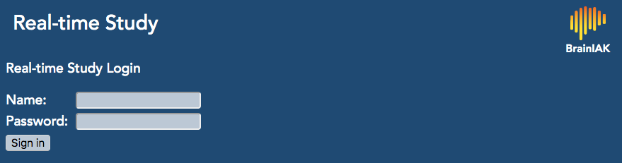
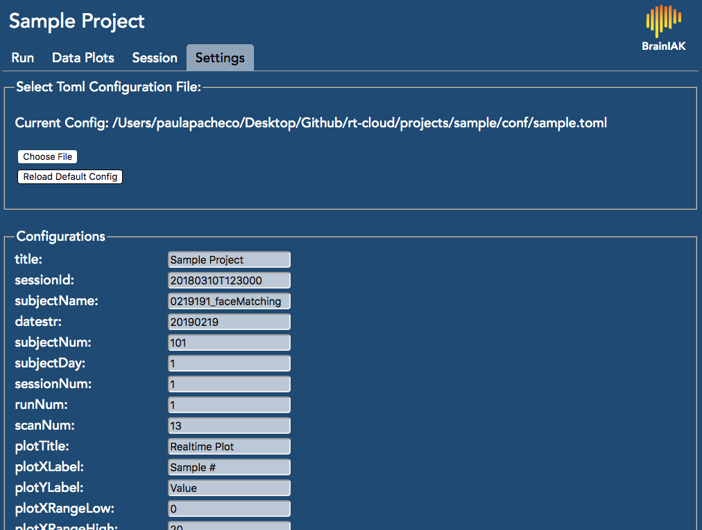
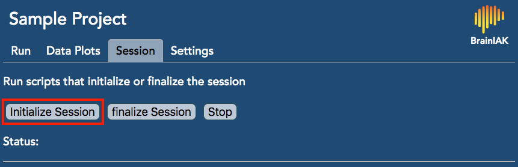
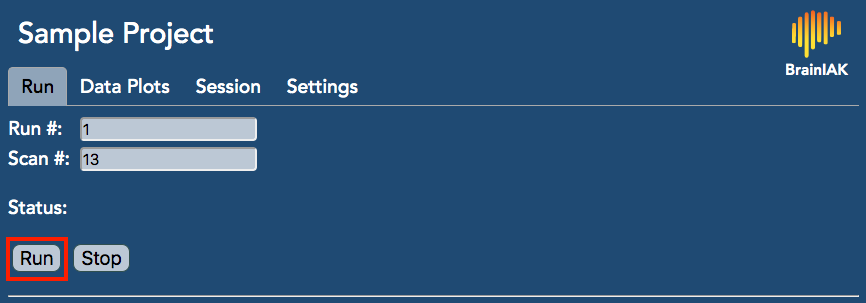
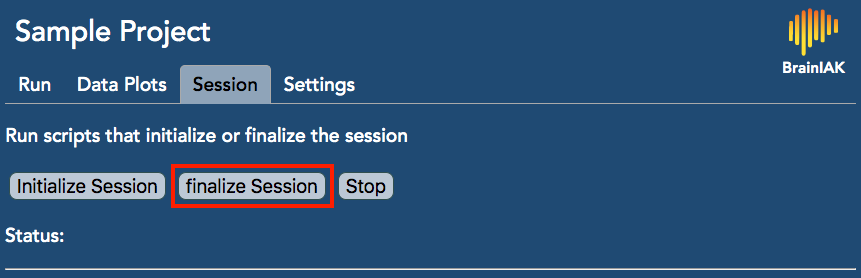

# The Sample Project

The purpose of this sample project is to familiarize you with the tools that are available to you through our **Realtime fMRI Cloud Framework**. In these scripts, we will walk you through a rudimetary project example where we will:

- Simulate starting a projectInterface session on the cloud.
    - In this example, you will do this from your local computer but under the real experiment circumstances you would start the projectInterface from the cloud.
- Simulate starting a fileServer session on the stimulus computer, which will automatically receive dicom files from the Siemens console computer after you change some parameters to the console.
    - Again, in this example, you will do this from another terminal window on your local computer but under real experiment circumstances you would start the fileServer from the stimulus computer to initialize a watch for incoming files of interest (e.g., dicoms). 
- Review the settings on the configuration file that are on the cloud using the web browser.
- Initialize a real-time experiment session from the web browser.
- Run a real-time experiment session:
    - that simulates receiving dicoms\* in real-time
    - that converts the dicoms received into nifti files
    - but that *only* does a very simple analysis (obtaining the average activation value across all voxels)
    - that plots the values of interest on the internet browser
- Finalize the real-time experiment session.

## What's inside the sample project?
There are six main components to the sample project, which are delineated below. The python scripts can be started on the cloud computer by using the web interface, or they can be started directly from the command line. In this sample project, we will be using the web interface. However, see [Testing the Sample Project, alternate step 3](https://github.com/paulapbrooks/rt-cloud/tree/sample_dev#testing-the-sample-project)) if you wish to run the python scripts from the command line and be able to retrieve remote files afterwards:
- **`conf` folder**
    - This includes a configuration *toml* file that includes defaults to important variables. For instance, the default for the variable `subjectNum` is 101. Here, we also have the naming pattern used for the dicoms (`001_0000{}_000{}.dcm`). For your experiment, you will have to change the contents of this file to fit your needs.
        - NOTE: Usually, a specific *toml* file is set up for each participant. This is the configuration file that is used across all of the runs. 
- **`dicomDir` folder**
    - Here, you will find 10 raw dicoms that we collected. The purpose of these are purely educational.
    - \*We have special permission from the Princeton Institutional Review Board to publicly post the dicoms on this Github repository. 
        - **IMPORTANT:** DO NOT post the raw dicoms for your experiment on Github!!
- **`projectMain` script**
    - This script is called when you run the projectInterface. The projectInterface starts the web server in the cloud and initializes communication with the file server. From a browser window pointed to the web server URL you will have controls to start and stop your project scripts.
- **`initialize` script**
    - The purpose of this script is to run certain commands *before* you start your experiment. In this sample project, a temporary `tmp` folder is created with sub-directories `stimulus_directory` and `cloud_directory` to illustrate the interaction between the stimulus computer and the cloud. 
        - NOTE: Under normal circumstances, all of the python scripts here will be running in the cloud. This means that, from your scripts' perspective, the `cloud_directory` would be a local directory whereas the `stimulus_directory` would be a remote directory.  
- **`sample.py` script**
    - This is the script that actually runs the experiment! All of these scripts are well-documented, especially this one. Take a look at the comments to gain a better understanding of how we do what we do here.
- **`finalize` script**
    - The purpose of this script is to run certain commands *after* you finish running your experiment to finalize things. For instance, you can download files from the cloud to the stimulus computer. You can also delete files from the cloud, which you might want to do for privacy.

## How do I make the sample project work?
1. Follow the [installation instructions](https://github.com/brainiak/rt-cloud#installation) for the realtime fMRI cloud framework

2. Follow the [testing the sample project instructions](https://github.com/brainiak/rt-cloud#testing-the-sample-project) on the main repo page.
    
    - Before you start the fileServer, you have to be mindful to set up the commands so that it can run the sample project appropriately (refer to documentation about [Running ProjectInterface in the Cloud, section 2](https://github.com/brainiak/rt-cloud/blob/master/docs/how-to-run.md#running-projectinterface-in-the-cloud) for more details). Specifically, you will want to include the following information:
        - *allowed directories* → The full path of the directories the fileserver will return files from. For security, the fileserver will restrict directories not explicitly noted here.
            - In this example, you will need to use the full path to the `sample` directory.
        - *allowed file extensions* → The list of extensions for the file types that will be allowed. Again for security, the fileserver will otherwise restrict which file types it will return.
            - In this example, you will need to allow the following extensions: `.dcm`, `.txt`, and `.mat`
        - IMPORTANT: The previous notes are important because the projectInterface, which runs from the cloud, *needs* to get permission about what can be read or written to the stimulus computer.

3. When you navigate your web browser to the URL [http://localhost:8888/](http://localhost:8888/), you will see the following page:

Log in using the username and password you set up during the initial installation.

4. On the web browser, go to the `Settings` tab to look at the default values that were read from the configuration `toml` file on the cloud.

- For this sample project, you don't have to change any of the settings. However, this is the location where you can edit configurations (there is no 'save' button, they will take effect on your next run). You can also load a new configuration file by using **Choose File** or reset to the original default settings by pressing **reloadDefaultConfig**.

5. Click on **Initialize** in the `Session` tab to run `initialize` python script. 

6. To run the experiment, go to the `Run` tab and click on **Run**.

7. Once you're done running the sample project, click on **Finalize** in the `Session` tab.

In conjunction to the steps above, we highly encourage you to open the relevant scripts in a code text editor. The scripts are well documented and will hopefully help you understand how things work!

### Where can I find different things?
All of the functions we use within the real-time fMRI cloud framework live in the **rtCommon** folder. There are three scripts that are especially relevant in the sample project:

- **`fileClient` script**
    - The functions enable you to interact with files, from starting a lookout (or watch) for a specific type of file to displaying all of the allowed file types.
- **`projectUtils` script**
    - The functions here allow you to interface between the cloud and the consol computer. For instance, if you want to download files from the cloud there's a function to help you do that here!
- **`imageHandling` script**
    - The purpose of these functions is to help you (1) transfer dicom files back and forth from the cloud and (2) convert the dicom files to nifti files, which is a file format that is better for data analyses.
